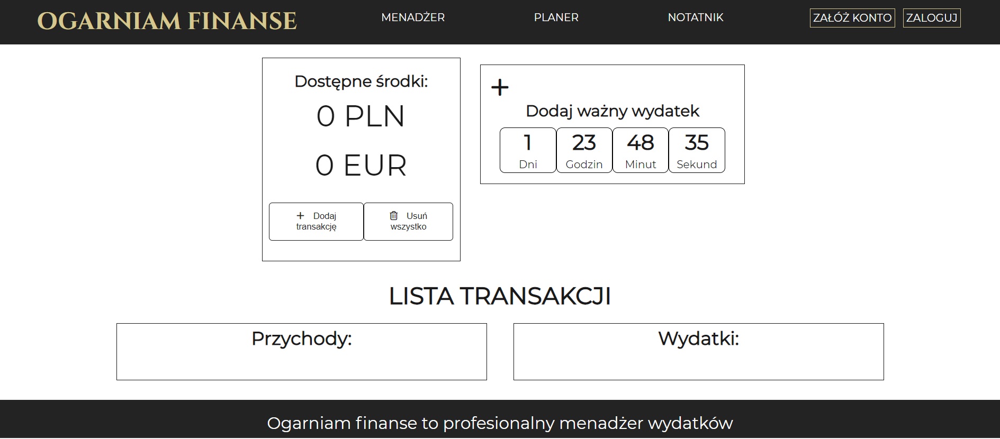
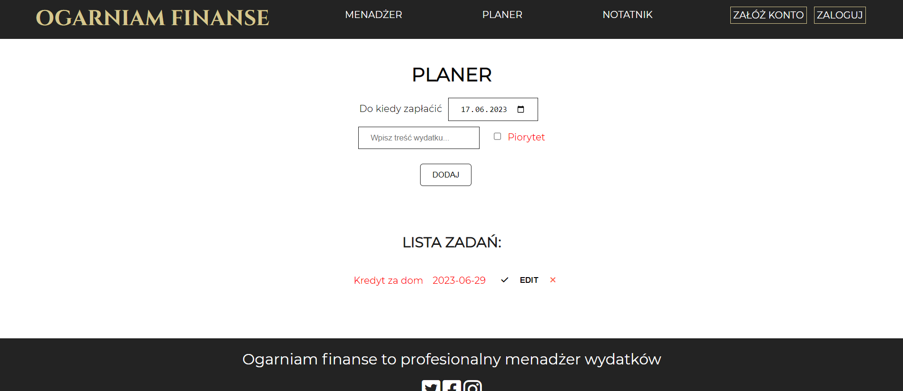
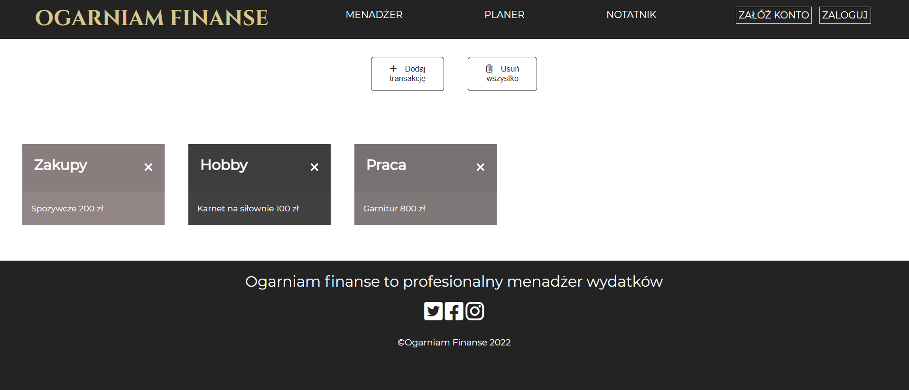
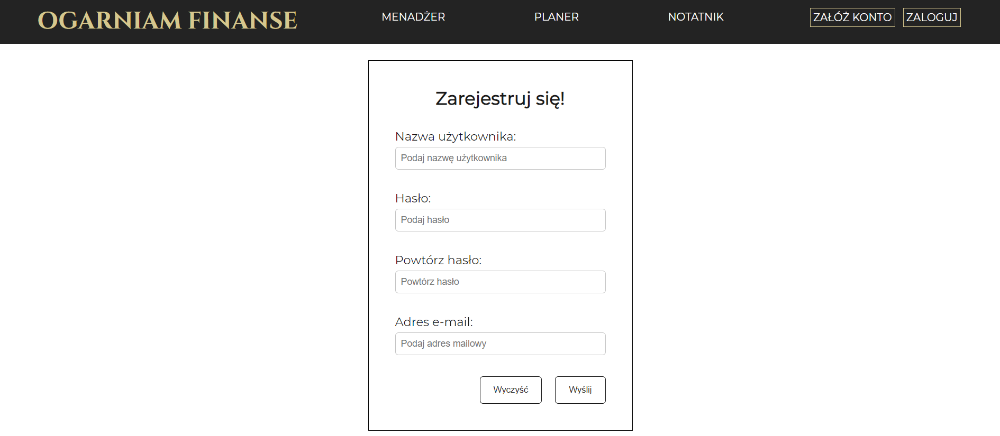

# Ogarniam Finanse - financial management application

## General info

**The application contains several functionalities:**

- Expense manager (total revenue and expenses)
- Exchange rate (connection to external api)
- Important expense (countdown to this event)
- Notebook (adding notes)
- Planner (advanced ToDo List)
- Form validator (login and registration)

## Technologies

- Html
- Css
- Sass
- BEM
- JavaScript
- RWD

## Screenshots

## Setup

[Link to the page](https://tomaszposluszny.github.io/finance-manager-JS/)
